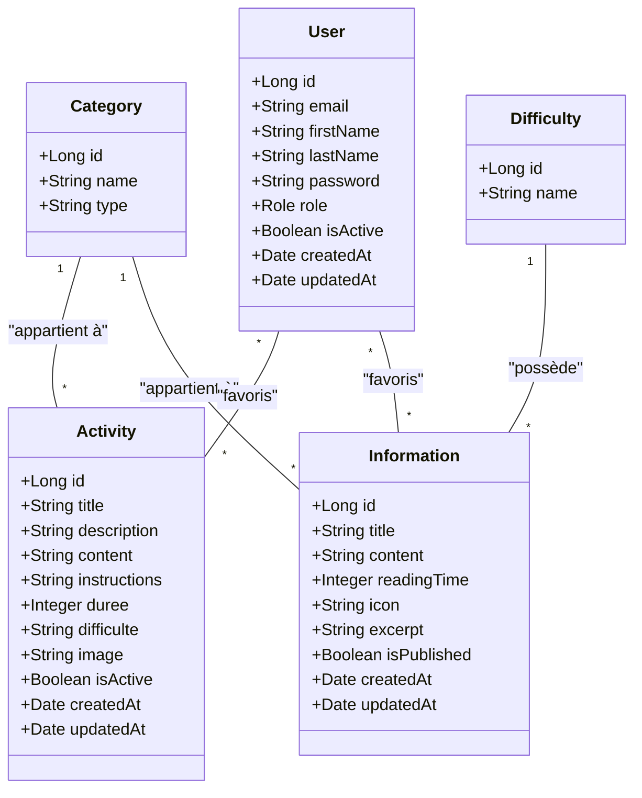
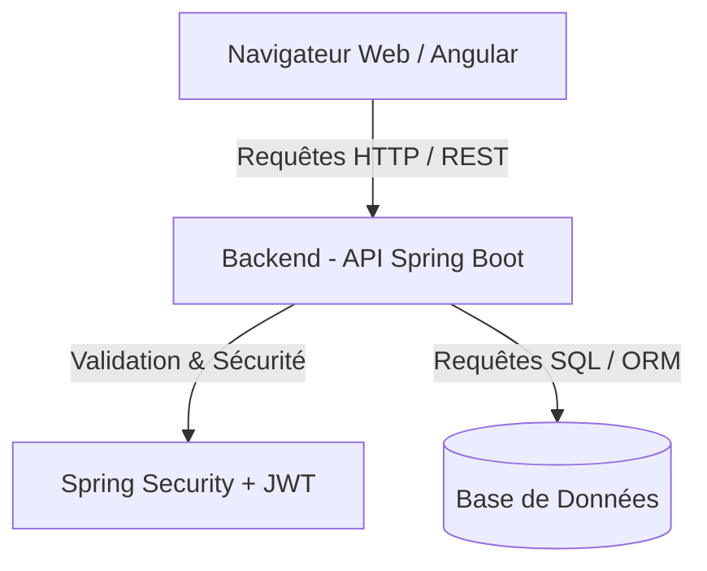
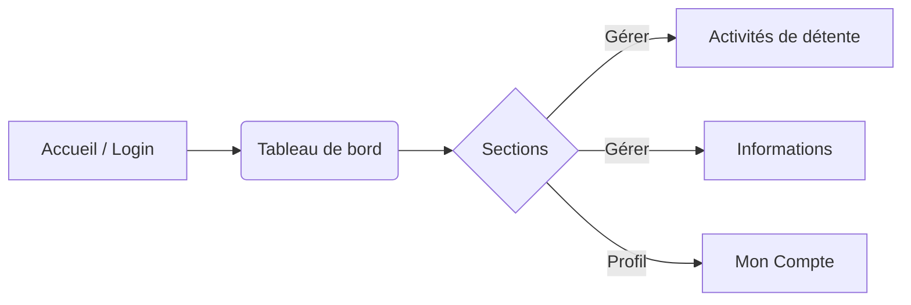
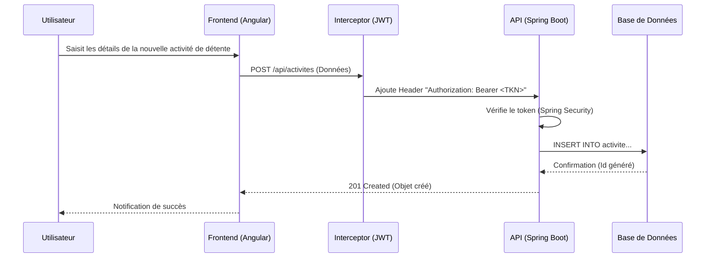

<div style="font-family: Calibri;">

# Documentation Technique - Bloc 2

## PARTIE I : Documentation Technique

### 1. Modélisation physique de la base de données : MLD

Pour représenter notre persistance, voici la **Modélisation physique de la base de données (MLD)**, issue des règles de passage depuis le Modèle Conceptuel de Données (MCD).

**MLD Formel :**
- **USERS** (<u>id</u>, email, first_name, last_name, password, role, is_active, created_at, updated_at)
- **ACTIVITIES** (<u>id</u>, title, description, content, instructions, duree, difficulte, image, is_active, created_at, updated_at, *#category_id*)
- **INFORMATIONS** (<u>id</u>, title, content, reading_time, icon, excerpt, is_published, created_at, updated_at, *#category_id*, *#difficulty_id*)
- **CATEGORIES** (<u>id</u>, name, type)
- **DIFFICULTIES** (<u>id</u>, name)
- **USER_FAVORITE_ACTIVITIES** (<u>*#user_id*</u>, <u>*#activity_id*</u>)
- **USER_FAVORITE_INFORMATIONS** (<u>*#user_id*</u>, <u>*#information_id*</u>)
*(Note: Les champs marqués d'un # sont des clés étrangères).*

**Schéma relationnel étendu (UML pour compréhension métier) :**



### 2. Comparatif des solutions techniques envisagées

Afin de garantir une application robuste, nous avons comparé trois architectures selon 5 critères majeurs et une échelle de notation de 1 (Faible) à 5 (Excellent).

### 1.1 Comparatif (Méthodologie et Évaluation)

| Critères d'évaluation | Arch 1 : Monolithe (Spring MVC + Thymeleaf) | Arch 2 : N-Tiers Séparée (Spring Boot REST + Angular) | Arch 3 : Microservices + Front indépendant |
| :--- | :---: | :---: | :---: |
| **1. Maintenabilité & Évolutivité** | 2 | 4 | 5 |
| **2. Performances (Temps de réponse client)** | 3 | 5 | 4 |
| **3. Facilités de déploiement (Coût/Complexité)** | 5 | 3 | 1 |
| **4. Séparation des préoccupations (Front/Back)** | 1 | 5 | 5 |
| **5. Richesse de l'interface & Ergonomie** | 2 | 5 | 5 |
| **Score Total** | **13 / 25** | **22 / 25** | **20 / 25** |

### 2.2 Pertinence de la solution retenue et Argumentation
Nous avons sélectionné l'**Architecture 2 (N-Tiers avec Spring Boot API + Angular)**. 
- **Performances et Ergonomie** : Angular permet la création d'une Single Page Application (SPA) extrêmement fluide (pas de rechargement de page), essentielle pour l'expérience utilisateur et facilement adaptable sur mobile.
- **Maintenabilité** : La séparation stricte entre l'API REST (Spring Boot) et le Front (Angular) permet à des équipes différentes d'intervenir, de tester les couches de façon atomique et potentiellement de remplacer le front-end sans réécrire le back-end.

### 2.3 Contraintes de Conception et Réalité de Déploiement
Bien que l'Architecture 3 (Microservices) ait obtenu une excellente note sur l'évolutivité, le choix final de déploiement s'est porté sur l'**Architecture 2 (N-Tiers avec Spring Boot API + Angular)**. Les **contraintes de conception**, notamment le temps alloué au projet, le coût de l'hébergement cloud (DevOps) et la taille restreinte de l'équipe (projet individuel), ne justifiaient pas la complexité d'un maillage microservices, mais rendaient l'exploitation de **frameworks structurés** incontournable pour respecter de bonnes pratiques de découplage MVC/N-Tiers.

---

### 3. Guide d'Installation

Guide complet étape par étape pour déployer l'environnement de développement :

1. **Prérequis** : Java 17+, Node.js (v18+), Angular CLI, PostgreSQL ou MySQL.
2. **Base de Données** : 
   - Créer une base nommée `cesizen_db`.
   - Les scripts de création et d'initialisation se trouvent dans `backend/src/main/resources/init.sql`.
3. **Backend** :
   - Ouvrir un terminal dans le dossier `/backend`.
   - Adapter les accès BDD dans `application.yml`.
   - Lancer avec Maven : `./mvnw spring-boot:run`. Le backend démarre sur `http://localhost:8080`.
4. **Frontend** :
   - Ouvrir un terminal dans le dossier `/frontend`.
   - Installer les dépendances : `npm install`.
   - Lancer l'application : `ng serve`. Le site est accessible sur `http://localhost:4200`.

---

### 4. Présentation de l'Application et Architecture

#### 4.1 Architecture Technique
L'application **CESIZen** repose sur une architecture N-Tiers, séparant clairement les responsabilités entre l'interface utilisateur, la logique métier et l'accès aux données.

**Stack Technique :**
- **Frontend** : Angular (TypeScript), gestion des requêtes via HttpClient et sécurisation par intercepteur HTTP (JWT).
- **Backend API** : Java Spring Boot, exposant une API RESTful.
- **Persistance** : Base de données relationnelle (via Spring Data JPA/Hibernate).

#### 4.2 Schéma d'Architecture Globale



---

### 5. Implémentation Front-End (Angular)

L'application côté client est organisée sous forme de modules ou de composants "Standalones". 

#### 5.1 Structuration Organisée
- **Dossiers `pages`** : `activites`, `informations`, `compte`, `admin`, `home` contenant les composants visuels.
- **Dossiers `services`** : `activite.service.ts`, `information.service.ts`, `auth.service.ts`, `category.service.ts`, `favorite.service.ts` pour la récupération des données et la gestion des actions utilisateur.
- **Intercepteurs** : `jwt.interceptor.ts` intercepte chaque requête HTTP pour injecter automatiquement le token de sécurité.

#### 5.2 Schéma de Navigation (Routing)



#### 5.3 Ajouts récents : Formulaires de création et Actions sécurisées

- **Panneau d'administration** : La création d'informations et d'activités s'effectue directement dans le panneau d'administration via des formulaires intégrés (inline). Ces formulaires interagissent avec les Observables standard du `HttpClient` fournis par les Services (`activite.service.ts` et `information.service.ts`), assurant un traitement réactif des requêtes de création.
- **Bouton Favori (Activités & Informations)** : La logique de mise en favori sur les pages des activités et informations valide préalablement l'état d'authentification (`isLoggedIn`). Si l'utilisateur n'est pas authentifié, il est automatiquement redirigé vers la page de connexion (`/compte`) à l'aide du `Router` d'Angular, garantissant la sécurisation des interactions métier. Le service `favorite.service.ts` est appelé pour communiquer avec l'API et mettre à jour le statut de favori.
- **Catégories dynamiques**: Les catégories pour les activités et les informations ne sont plus codées en dur. Elles sont récupérées depuis l'API via le `category.service.ts` et affichées dynamiquement, permettant une gestion centralisée depuis le backend.
- **Correction du chargement des données**: L'injection de `ChangeDetectorRef` dans les composants `activites` et `informations` et l'appel de la méthode `detectChanges()` après la réception des données asynchrones garantissent que la vue est rafraîchie immédiatement, corrigeant le problème où les données n'apparaissaient qu'après une interaction de l'utilisateur.

---

### 6. Implémentation Back-End (Spring Boot) et Conception

L'API fournit les endpoints nécessaires à l'application Angular. Elle respecte les principes REST (GET, POST, PUT, DELETE).

#### 6.1 Diagramme de Séquence : Création d'une Activité / Information



---

### 7. Sécurité des Composants

L'application implémente plusieurs couches de sécurité conformes aux normes standards (OWASP) :
1. **Authentification** : Gestion par token JWT (JSON Web Token) généré lors de la connexion via `auth.service.ts`.
2. **Protection CSRF / XSS** : Les frameworks (Angular et Spring) intègrent des protections natives contre l'injection de scripts et les failles CSRF sur les API REST stateless.
3. **Contrôle d'accès (RBAC)** : Vérification des rôles (Admin/User) coté API avant chaque modification de données pour la création des `informations` et `activités`.

### 8. Détail des fonctionnalités livrées côté Front-End

Cette version de CESIZen ne se limite plus à un affichage statique. Les écrans Angular portent désormais des interactions métier complètes, testables et cohérentes avec l'API.

#### 8.1 Page d'accueil
La page d'accueil sert de porte d'entrée de l'application et expose trois responsabilités distinctes.
- **Présentation** : mise en avant du positionnement de CESIZen et des fonctionnalités principales.
- **Indicateurs dynamiques** : chargement du nombre de comptes, d'activités et d'informations en ligne via les services API.
- **Navigation rapide** : redirections vers les contenus et l'authentification.

#### 8.2 Page Informations
La page `informations` agrège les articles publiés et les organise en cartes lisibles.
- **Chargement des contenus publiés uniquement** : le front consomme l'endpoint dédié aux articles publiés.
- **Filtrage par catégorie** : les catégories sont récupérées dynamiquement et permettent de filtrer l'affichage.
- **Favoris** : un utilisateur connecté peut ajouter ou retirer un article de ses favoris.
- **Accès conditionnel** : un utilisateur non authentifié est renvoyé vers la page de compte avant toute action de favori.

#### 8.3 Page Activités
La page `activites` reprend la même logique fonctionnelle pour les activités de détente.
- **Liste des activités actives** : seules les activités utilisables sont affichées.
- **Tri et filtrage** : tri par durée ou par nom, filtrage par catégorie.
- **Favoris** : gestion symétrique avec la page d'informations.
- **Réactivité de vue** : l'appel à `detectChanges()` garantit un rafraîchissement immédiat après réception des données.

#### 8.4 Page Compte
La page `compte` concentre le parcours utilisateur.
- **Connexion** : validation du format d'e-mail et gestion des erreurs de connexion.
- **Inscription** : contrôle de cohérence entre le mot de passe et sa confirmation.
- **Déconnexion** : nettoyage du stockage local et réinitialisation des états locaux.
- **Restauration de session** : l'utilisateur déjà stocké en local est rechargé au démarrage du service.

#### 8.5 Panneau Admin
Le panneau `admin` centralise les actions de gestion de contenu.
- **Création et édition** : formulaires intégrés pour activités, informations et catégories.
- **Publication / activation** : changement rapide d'état des contenus.
- **Tri des colonnes** : les listes peuvent être ordonnées par plusieurs champs.
- **Découpage métier** : chaque section possède ses propres règles de validation et de chargement.

#### 8.6 Gestion des favoris
La fonctionnalité de favoris est un point de convergence important entre l'interface et le backend.
- **Source d'état** : l'identifiant utilisateur est lu depuis `AuthService`.
- **Routage de sécurité** : sans session, l'application redirige vers `/compte`.
- **Réversibilité** : en cas d'échec HTTP, l'état visuel du favori est annulé pour rester cohérent avec le serveur.
- **Traçabilité** : les endpoints de favoris reposent sur des routes distinctes pour activités et informations.

### 9. Stratégie de tests et automatisation

L'objectif de validation est d'avoir une pyramide de tests simple, lisible et exploitable dans un projet individuel.

#### 9.1 Tests unitaires
Les tests unitaires couvrent les briques dont la logique peut être isolée sans navigateur réel.
- `auth.service.spec.ts` : persistance locale, login, update profil, logout.
- `jwt.interceptor.spec.ts` : ajout du header `Authorization`.
- `navbar.component.spec.ts` : menu, nom affiché, réaction au flux utilisateur.
- `home.component.spec.ts` : calcul des compteurs et gestion des erreurs.
- `informations.component.spec.ts` : filtrage, chargement et favoris.
- `activites.component.spec.ts` : filtrage, tri et favoris.
- `compte.component.spec.ts` : validations de formulaires et scénarios de session.
- `admin.component.spec.ts` : chargements, tri et actions de gestion.

#### 9.2 Tests fonctionnels
Les tests fonctionnels valident le comportement observable par l'utilisateur sur un écran donné.
- Vérification du rendu des cartes et des listes.
- Vérification des redirections de navigation.
- Vérification des états actifs et désactivés.
- Vérification de la cohérence entre interaction utilisateur et mise à jour de vue.

#### 9.3 Tests de non-régression
Les tests de non-régression empêchent le retour d'un bug déjà corrigé.
- Favoris réservés aux utilisateurs authentifiés.
- Restauration de session lors du rechargement de `AuthService`.
- Rafraîchissement de vue après chargement asynchrone.
- Tri et filtrage des listes sans mutation inattendue de la source.

#### 9.4 Automatisation retenue
L'automatisation repose sur le socle déjà présent dans le projet front.
- **Runner** : `ng test` via le builder Angular de test.
- **TypeScript des specs** : `tsconfig.spec.json` configuré pour Vitest global.
- **Exécution rapide** : commandes `npm run test:unit`, `npm run test:functional`, `npm run test:regression`.
- **Intégration VS Code** : tâches dédiées dans `.vscode/tasks.json`.

#### 9.5 Résultats obtenus
La suite front valide actuellement 32 tests répartis sur 8 fichiers de specs. Cette base couvre le comportement des services, des composants de page et des garde-fous applicatifs liés à l'authentification.

#### 9.6 Cahier de recette délocalisé
Le cahier de recette complet a été extrait du corps de cette documentation et déposé dans le fichier `CAHIER_RECETTE_TESTS.md` (racine du dépôt). Ce fichier contient la matrice de tests détaillée (ID Test, Module, Fonctionnalité, Pré-conditions, Étapes, Données de test, Résultat attendu, Résultat obtenu, Statut, Commentaires, Criticité, Responsable, Date) ainsi que les nouveaux cas ajoutés lors des dernières implémentations :

- Tests de sécurité API et RBAC (`SEC-01` à `SEC-03`)
- Cas d'administration et de publication (`ADM-*`)
- Cas étendus pour les activités (`ACT-*`) et les favoris (`INF-*`, `ACT-*`)

Ce fichier est conçu pour être copié-collé dans Excel ; je peux également générer un CSV (`;` séparateur) prêt à l'import si tu le souhaites.

### 10. Procédures d'exécution et validation

Pour garder la documentation utile au quotidien, les commandes essentielles sont rassemblées ici sans répéter les mêmes explications dans chaque guide.

#### 10.1 Frontend
```bash
cd frontend
npm install
npm run test:unit
ng serve
```

#### 10.2 Backend
```bash
cd backend
./mvnw test
./mvnw spring-boot:run
```

#### 10.3 Séquence recommandée
1. Lancer le backend.
2. Vérifier la base de données.
3. Lancer le frontend.
4. Exécuter les tests unitaires front.
5. Rejouer le parcours fonctionnel critique.

### 11. Déploiement et exploitation

Le déploiement vise un fonctionnement simple pour un contexte de projet individuel.
- **Backend** : démarrage Spring Boot avec profil local et base de données dédiée.
- **Frontend** : build Angular standard et diffusion du dossier de sortie.
- **Configuration** : les URL d'API restent explicites afin de faciliter les tests locaux.
- **Surveillance** : les erreurs réseau côté front remontent de manière visible dans les états d'interface ou les logs console.

### 12. Maintenance et évolutivité

L'organisation actuelle facilite l'ajout de nouvelles fonctionnalités sans casser l'existant.
- Une nouvelle page se crée dans `src/app/pages/` avec une route associée.
- Une nouvelle source de données s'isole dans `src/app/services/`.
- Une logique transversale se factorise dans `shared/` ou dans un intercepteur.
- Les tests doivent suivre la règle: toute logique métier ajoutée doit être couverte par au moins un spec ciblé.

### 13. Traçabilité fonctionnelle

| Besoin métier | Implémentation front | Implémentation back | Test associé |
| :-- | :-- | :-- | :-- |
| Connexion utilisateur | `compte.component.ts` | `auth` endpoints | CU-03 |
| Gestion du profil | `auth.service.ts` + `compte.component.ts` | `/users/{id}` | CU-04 |
| Consultation des infos | `informations.component.ts` | `/informations/published` | INF-01 |
| Création d'information | `admin.component.ts` | `/informations` | INF-02 |
| Favoris d'articles | `favorite.service.ts` | endpoints favoris | non-régression |
| Liste d'activités | `activites.component.ts` | `/activities/active` | ACT-01 |
| Panneau admin | `admin.component.ts` | CRUD complet | ACT-02 / INF-02 |

### 14. Limites connues et pistes d'amélioration

Cette version couvre un socle solide, mais plusieurs améliorations restent naturelles pour une itération future.
- Ajouter de vrais tests e2e navigateur pour couvrir le parcours complet.
- Externaliser les URL d'API dans les environnements Angular.
- Factoriser davantage les appels HTTP répétitifs entre services.
- Ajouter des tests sur le rendu HTML des composants les plus interactifs.
- Améliorer la gestion centralisée des erreurs réseau pour réduire la duplication.

### 15. Conclusion technique

CESIZen repose désormais sur une base plus propre à maintenir: architecture séparée, favoris sécurisés, pages interactives, et suite de tests front exploitable. Le projet dispose d'un socle documentaire et technique suffisant pour continuer à évoluer sans repartir de zéro.

---

## PARTIE II : Documentation relative à la livraison

### 1. Cahier de tests et Scénarii Détaillés

Remarque : les scénarios détaillés ont été déplacés vers `CAHIER_RECETTE_TESTS.md` (racine du projet). La section qui suit conserve un résumé et des cas de référence.

Afin de s'assurer de la complétude du prototype pour les 2 modules obligatoires (Comptes utilisateurs, Informations) et 1 module optionnel (Activités de détente), voici le détail des scenarii fonctionnels (résumé).

#### Module Obligatoire 1 : Comptes Utilisateurs
| ID Test | Titre | Description de l'action | Résultat Attendu | Statut |
| :-- | :-- | :-- | :-- | :--: |
| CU-01 | Inscription valide | Soumission formulaire avec email non existant | Compte créé, notification succès | OK |
| CU-02 | Inscription invalide | Mot de passe faible / Email déjà pris | Message d'erreur clair empêchant création | OK |
| CU-03 | Connexion réussie | Fournir identifiants valides existants | JWT reçu, redirection vers Tableau de Bord | OK |
| CU-04 | Édition de profil | Modifier ses informations personnelles | Mise à jour en BDD confirmée | OK |

#### Module Obligatoire 2 : Informations
| ID Test | Titre | Description de l'action | Résultat Attendu | Statut |
| :-- | :-- | :-- | :-- | :--: |
| INF-01 | Lecture des informations | Utilisateur connecté navigue sur /informations | Liste des informations affichée proprement | OK |
| INF-02 | Ajout d'information (Admin) | Soumission du formulaire d'ajout avec titre/contenu | Création validée (Code HTTP 201) | OK |
| INF-03 | Tentative d'ajout (User classique) | Forcer appel API POST /informations | Refusé avec statut 403 Forbidden | OK |
| INF-04 | Validation saisie | Soumission avec un titre manquant | Refusé en front (bouton grisé) et back (Code 400) | OK |

#### Recette Front-End automatisée
| ID Test | Cible | Description | Résultat attendu | Statut |
| :-- | :-- | :-- | :-- | :--: |
| FE-UT-01 | `auth.service.spec.ts` | Vérifier login, logout, update profile et persistance locale | Comportement stable du service | OK |
| FE-UT-02 | `jwt.interceptor.spec.ts` | Vérifier l'injection du header JWT | Requête enrichie si token présent | OK |
| FE-UT-03 | `home.component.spec.ts` | Vérifier les compteurs et les erreurs de chargement | Statuts affichés correctement | OK |
| FE-UT-04 | `informations.component.spec.ts` | Vérifier filtrage et favoris | Navigation et favoris cohérents | OK |
| FE-UT-05 | `activites.component.spec.ts` | Vérifier tri, filtrage et favoris | Liste cohérente et stable | OK |
| FE-UT-06 | `admin.component.spec.ts` | Vérifier chargements, tri et actions d'administration | État des collections conforme | OK |
| FE-UT-07 | `compte.component.spec.ts` | Vérifier validation d'email, mot de passe et inscriptions | Messages de validation corrects | OK |
| FE-UT-08 | `navbar.component.spec.ts` | Vérifier menu et nom utilisateur | Interface de navigation stable | OK |

#### Module Optionnel / Libre : Activités de détente
| ID Test | Titre | Description de l'action | Résultat Attendu | Statut |
| :-- | :-- | :-- | :-- | :--: |
| ACT-01 | Affichage des activités | Consulter la liste des activités prévues | Rendu ergonomique (ex: Cards) adapté mobile | OK |
| ACT-02 | Proposition d'activité | Déclaration d'une nouvelle activité (titre, date, desc) | Activité enregistrée comme "En attente/Créée" | OK |
| ACT-03 | Filtre / Recherche | Rechercher une activité par mot-clé | Affichage mis à jour en temps réel | OK |

*(Ces tests fonctionnels, en plus des tests unitaires backend via JUnit, couvrent la totalité du cycle de vie des modules.)*

### 2. Procédure de Validation
1. **Déploiement en Staging** : L'application est lancée sur un environnement de test identique à la production.
2. **Exécution Automatisée** : Les tests unitaires backend (`mvn test`) et frontend (`npm run test:unit`) sont lancés.
3. **Exécution Manuelle Client** : Parcours du cahier de tests ci-dessus par le Product Owner / Testeur pour vérifier le comportement UI et l'ergonomie.
4. **Correction des Anomalies** : En cas de bug, remontée d'un ticket.
5. **Signature** : Si tous les scénarios critiques réussissent, approbation et signature du Procès-Verbal de recette.

### 3. Modèle de Procès-Verbal (PV) de Recette

**DÉCLARATION DE RECETTE - PROTOTYPE CESIZen**

**Date de la recette :** `...........`
**Responsable Recette (Client) :** `...........`
**Responsable Développement :** `...........`

**Bilan d'exécution des Modules :**
- [ ] Module Comptes Utilisateurs : Scénarios CU-01 à CU-04 validés.
- [ ] Module Informations : Scénarios INF-01 à INF-04 validés.
- [ ] Module Activités de détente : Scénarios ACT-01 à ACT-03 validés.

**Statistiques des anomalies relevées :**
- Mineures (Esthétique) : `...`
- Majeures (Contournables) : `...`
- Bloquantes (Crash) : `...`

**Avis de validation :**
[ ] FAVORABLE (Sans réserve - Mis en production immédiat)
[ ] FAVORABLE AVEC RÉSERVES (A corriger sous délai court)
[ ] DÉFAVORABLE (Refus du livrable)

**Commentaires éventuels :**
..................................................................

</div>
..................................................................

---

## Annexe : Qualité et Conception 
- **Backend / API** : Développé via le framework Spring (Java), structuration stricte avec DTOs.
- **Frontend** : L'interface Angular garantit une séparation des préoccupations. Des choix ergonomiques marqués ont été réalisés pour proposer une interface agréable et fonctionnelle sur tous les écrans (Desktop, Tablettes, Mobiles).
